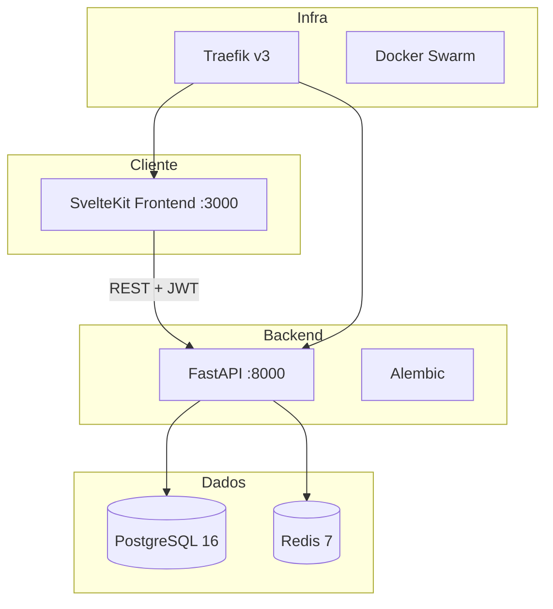

# Explore Tourism Brasil Seguro — Documentação Técnica Completa

> Plataforma multilíngue para turismo seguro no Brasil.

**Produção:** [tourism.vivdio.com](https://tourism.vivdio.com)  
**Última atualização:** 2026-05-22

---

## 1. Diagramas Técnicos

### 1.1 Arquitetura do Sistema



---

## 2. Estrutura de Pastas

```
tourism-app/
├── backend/                    # FastAPI REST API
│   ├── app/                    # Código da aplicação
│   │   ├── main.py             # Entry point
│   │   ├── models/             # SQLAlchemy models
│   │   ├── routes/             # Endpoints REST
│   │   └── services/           # Lógica de negócio
│   ├── alembic/                # Migrações
│   ├── tests/                  # Testes
│   └── Dockerfile              # Build
├── frontend/                   # SvelteKit web
│   ├── src/                    # Páginas e componentes
│   ├── static/                 # Assets
│   └── Dockerfile              # Build Nginx
├── frontend-react-native/      # 📱 App mobile (React Native)
├── docs/                       # Documentação
├── scripts/                    # Deploy e DNS
├── docker-compose.yml          # Dev local
├── docker-compose.prod.yml     # Produção Swarm
├── Taskfile.yml                # Task runner
└── .github/workflows/          # CI/CD (web, mobile, DNS, migrations)
```

---

## 3. Arquitetura de Software

| Camada | Tecnologia |
|--------|-----------|
| Frontend Web | SvelteKit + TypeScript |
| Frontend Mobile | React Native (em desenvolvimento) |
| Backend | FastAPI + SQLAlchemy 2 async |
| Database | PostgreSQL 16 |
| Cache | Redis 7 |

### Features Principais
- 🌍 Interface multilíngue (7+ idiomas)
- 🗺️ Mapas interativos com rotas em tempo real
- 🔒 Indicadores de segurança
- ✨ Recomendações personalizadas por perfil
- 🧳 Itinerários prontos (1, 3, 7 dias)
- 📍 Modo offline
- 🆘 Botão de emergência

---

## 4. Infraestrutura e Deploy

| Serviço | Imagem | Porta |
|---------|--------|-------|
| `tourism_frontend` | `ghcr.io/iago-costa/tourism-app-frontend` | 3000 |
| `tourism_backend` | `ghcr.io/iago-costa/tourism-app-backend` | 8000 |
| `tourism_db` | `postgres:16-alpine` | 5432 |
| `tourism_redis` | `redis:7-alpine` | 6379 |

CI/CD: `cd.yml`, `ci.yml`, `db-migrate.yml`, `cloudflare-dns.yml`, `ios-deploy.yml`, `android-deploy.yml`.

---

## 5. Propostas de Melhorias

### 5.1 🤖 Chatbot de Turismo
Assistente IA para recomendações personalizadas em tempo real.

### 5.2 👥 UGC (User-Generated Content)
Avaliações, fotos e dicas de outros viajantes.

### 5.3 🎟️ Integração com Reservas
Booking de passeios e experiências via API de parceiros.

### 5.4 📊 Analytics de Destinos
Heatmap de popularidade e tendências sazonais.

### 5.5 🌐 API Pública para Parceiros
SDK e API para agências integrarem dados de turismo.
